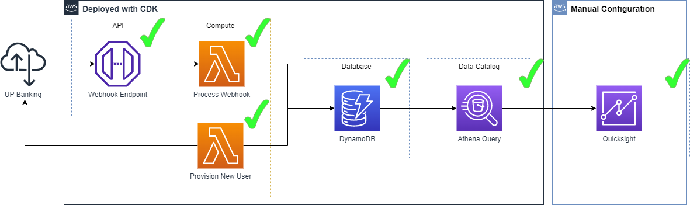
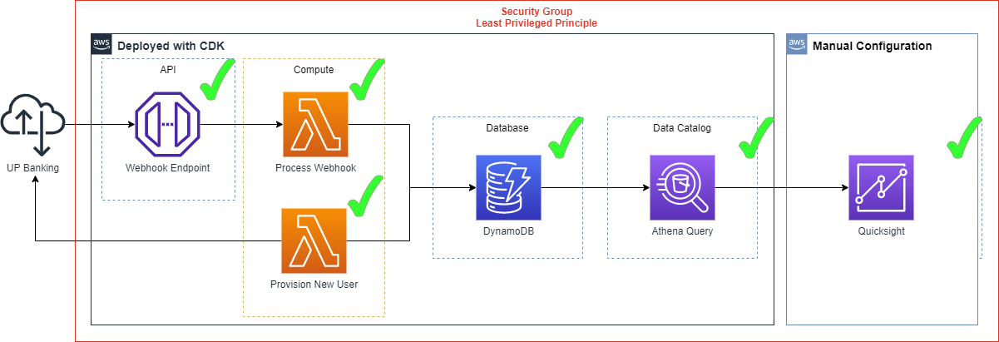
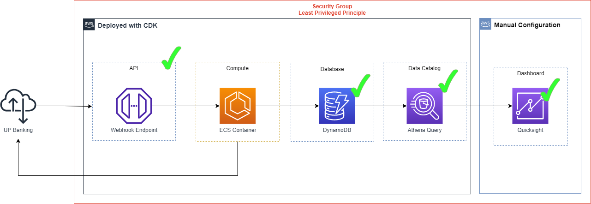
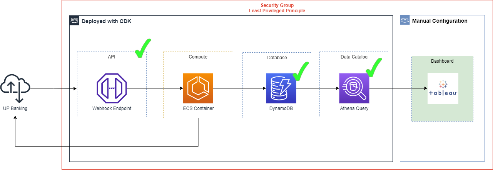

## DIY Dashboard as Code

## Versions
#### v0.1
* Provision new user
* Process webhook
* Write to dynamoDB
* Query data source
* Ingest data source
* CDK deployment

#### v0.2
* Security groups, rules and networks configured for least privileged principle
* Secrets management

#### v0.3
* Containerise API compute

#### v0.4
* Dashboard as code
* Tableau support
* https://docs.aws.amazon.com/quicksight/latest/APIReference/API_CreateAnalysis.html

#### v0.5
* Testing
* Logging
* Monitoring

#### v0.6
* Reliability
* High availability
* Failover

#### v0.7
* Custom data source

#### v0.8
* Multiple data sources